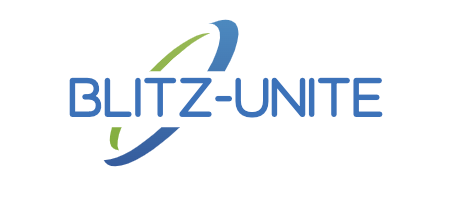

# Bibliothèque numérique

Avec ce projet, l'association CultureDiffusion détiendra une bibliothèque 100% numérique alimentée par ces membres. L'objectif étant que l'association puisse avoir un logiciel de gestion fonctionnel avec le principe du CRUD. Ainsi les membres pourront créer, lire, mettre à jour et supprimer les données qui seront ici, des livres, musiques et vidéos.

## Description

Le projet est un logiciel qui doit permettre de numériser les œuvres disponibles pour les utilisateurs. Il est développé par 4 personnes de l’entreprise Blitz Unite pour CultureDiffusion. De plus, plusieurs contraintes s’appliquent au projet. Les membres de l’association doivent pouvoir emprunter ou louer une œuvre, mais également en proposer une pour enrichir la bibliothèque, dans ce cas, les œuvres devront être modérées. Les bibliothécaires, eux, peuvent voir les œuvres et modifier les informations en cas d’erreur. Il y a également une contrainte juridique, les œuvres du domaine public sont accessibles gratuitement alors que celles sous droits sont accessibles 2 semaines. Pour permettre la bonne ergonomie du logiciel, les œuvres sont réparties en 4 rubriques. L’une pour les œuvres libres (fond commun), la suivante pour celles sous droits actuellement empruntés (emprunts), la rubrique "séquestre" pour les autres œuvres sous droits et enfin une rubrique pour les œuvres que les membres ont proposées (à modérer). Enfin, les œuvres sont classées en plusieurs catégories selon leur genre (BD, SF, Romans…).

## Contexte

Lors du projet nous avons utilisé des outils techniques tels que **PlantUML** pour la réalisation des différents diagrammes qui nous aiderons à la conception de ce logiciel. Nous utilisons différentes méthodologies de travail afin de réaliser un projet bien structuré, et qui répond au mieux possible aux exigences de notre client, avec la création de différents scénarios, de design pattern pour nous permettre d'avoir un projet qui repose sur des bases solides et ainsi que des différents diagrammes :

  - diagramme d'activité
  - diagramme de séquence
  - diagramme de classes

Pour réaliser ses différents moyens techniques et mettre en place ces méthodes, l'équipe de Blitz Unite composé de Rémi Fraszczak, Antonin Sanzovo, Antoine Andre et  Lucas Carlier on réfléchit à trouver la meilleur solution possible pour répondre au besoin de CultureDiffusion.

Conçu par Rémi Fraszczak, Antonin Sanzovo, Antoine Andre, Guillaume Delorme et Lucas Carlier de Blitz Unite.

Version v0.1

lundi 4 octobre 2021
>>>>>>> 7a936da487f7d75108b99a254919cd544d8dd1b7
